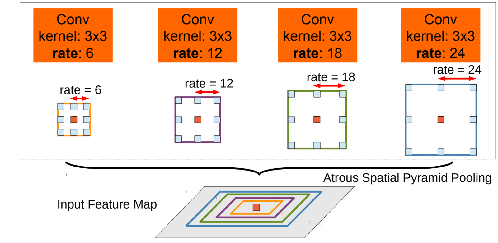

# BraTS - DeepLabV3+ Brain Tumor Segmentation

This project is a deep learning study that applies the **DeepLabV3 (ResNet50)** architecture to detect brain tumor sub-regions with high accuracy from multi-modal brain MRI images (FLAIR, T1CE, T2) using the **MICCAI BraTS 2021** dataset.


## Project Summary
Brain tumor segmentation is a critical step for clinical diagnosis, surgical planning, and treatment monitoring. In this project, complex 3D MRI volumes were decomposed into processable 2D slices for analysis. The applied model is designed to distinguish 3 different tumor classes in accordance with medical literature:

* **Class 1 (Necrotic / Tumor Core):** Necrosis
* **Class 2 (Edema):** Peritumoral Edema
* **Class 3 (Active / Enhancing Tumor):** Enhancing Tumor

*(Note: Class 4 labels in the original dataset were converted to Class 3 during the coding phase to ensure model compatibility and seamless training.)*

---

## Model Architecture and Training Strategy
Instead of a standard CNN, the **DeepLabV3+** architecture, which demonstrates high performance in segmentation tasks, was preferred for this project. The selection of this architecture and the data processing strategy are based on specific hardware constraints and theoretical foundations.

### Why 2D Slices Instead of 3D?
Medical MRI images are inherently 3-dimensional (Volumetric); however, these volumes were separated into 2D slices for model training. There are 3 main reasons for this approach:
1. **VRAM and Hardware Optimization:** 3D convolutional neural networks (3D CNNs) require massive amounts of GPU memory for model parameters and gradient calculations. To successfully train the model on local hardware (**NVIDIA RTX 2060 - 6GB VRAM**) with a reasonable batch size (8), dimensionality reduction was mandatory.
2. **Transfer Learning Advantage:** The model's backbone, `ResNet50`, was pre-trained on the massive ImageNet dataset using 2D images. The 2D slice approach allows the direct use of these powerful weights, enabling the model to converge much faster and with higher accuracy.
3. **Expanding the Data Pool:** Although the 3D data of 100 patients seems like a limited set, extracting tumor-containing slices from each patient yielded tens of thousands of 2D training images, significantly reducing the risk of overfitting.

### ASPP Module and Dilation Rates
Brain tumors can appear in vastly different sizes from patient to patient. To simultaneously detect a small necrotic core (Class 1) and peritumoral edema spread across a large portion of the brain (Class 2), DeepLabV3's **ASPP (Atrous Spatial Pyramid Pooling)** module was utilized.

* **Dilation Rates Used:** Based on the output stride settings, standard **[12, 24, 36]** dilation rates were used in the model.
* **Engineering Rationale (Receptive Field):** In classical convolution operations, "Pooling" is performed to reduce resolution in order to expand the field of view. Since pixel-level precision is crucial in segmentation, we aim to avoid resolution loss. Dilation places spaces between the pixels in the filter, allowing the model to observe a wider area without sacrificing resolution.
  * *Low Rates (e.g., 12):* Captures sharp tumor boundaries and small necrotic tissues.
  * *High Rates (e.g., 36):* Understands the context of broad edema regions and their position within the general structure of the brain.
  


### Training Parameters
* **Loss Function:** CrossEntropyLoss
* **Metric:** Class-based Dice Similarity Coefficient (Dice Score)
* **Optimization:** Adam Optimizer (Learning Rate: 1e-4)
* **Epoch Process:** The model was trained for 50 epochs. To prevent data imbalance, only masks containing tumors were included in the training process.


---


## Data Preprocessing
A meticulous data preparation process was carried out to feed the MRI images (NIfTI format) into the AI model in the most optimal way:

1. **Modality Stacking:** To provide the model with maximum information regarding the tumor, the `FLAIR` (effective for edema detection), `T1CE` (active tumor boundaries), and `T2` sequences were stacked. This presented a rich, 3-channel (RGB-like) tensor map to the model.
2. **Smart Slicing:** Empty (tumor-free) slices in 3D volumes slow down the model's learning process. During training, only slices containing tumors were dynamically filtered and added to the dataset list.
3. **Min-Max Normalization:** To prevent brightness variations (intensity bias) caused by different MRI scanners, each MRI slice was normalized individually to a `[0, 1]` range.

---

## Dataset Structure
Training and testing operations were performed using the **MICCAI BraTS 2021** dataset. For the project to run properly, the dataset must be located on your computer in the following directory structure:

```text
ROOT_DIR/
├── BraTS21_Training_001/
│   ├── BraTS21_Training_001_flair.nii
│   ├── BraTS21_Training_001_t1ce.nii
│   ├── BraTS21_Training_001_t2.nii
│   └── BraTS21_Training_001_seg.nii
├── BraTS21_Training_002/
...