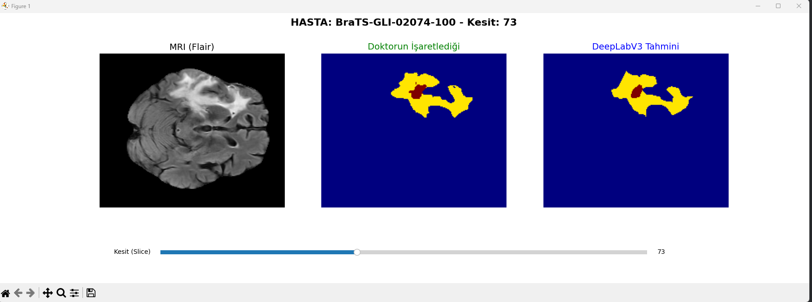
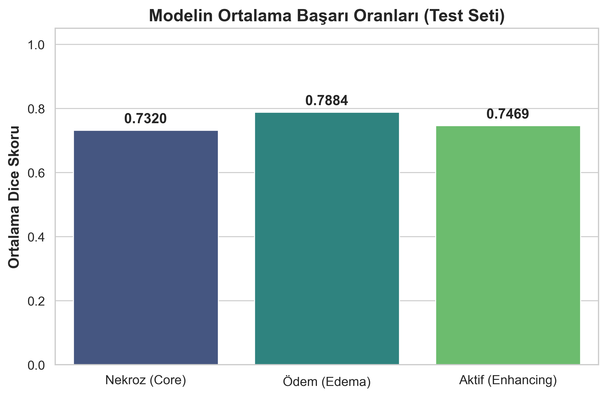
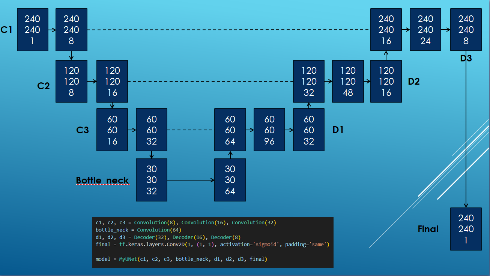
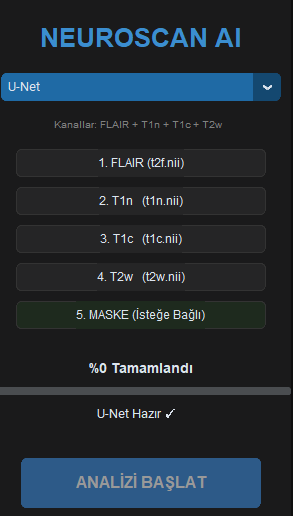
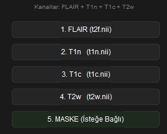
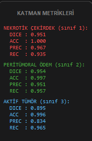
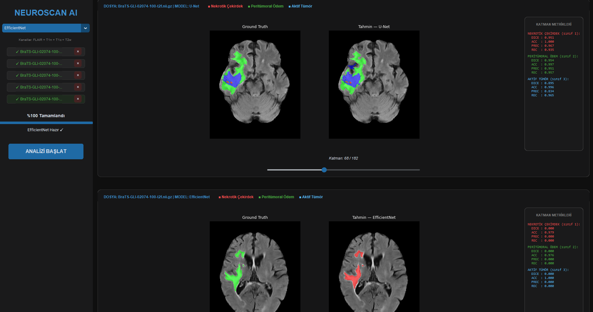

# Brain Tumor Segmentation (BraTS 2021) using U-Net & EfficientNet-B0

  

This repository presents a highly optimized Convolutional Neural Network (CNN) pipeline developed for multi-class brain tumor segmentation using the BraTS 2021 dataset. The project demonstrates an end-to-end deep learning architecture, focusing on memory optimization, I/O efficiency, and clinical metric evaluation.

  

**Developer:** Mehmet Gökgül

  

---

  

## 1. Pipeline Architecture & I/O Optimization

  

A significant engineering challenge in this project was overcoming the 12-hour training bottlenecks caused by heavy I/O operations and repetitive CPU-bound preprocessing.

  

To resolve this, the pipeline was re-architected to decouple preprocessing from the training loop. Raw 3D NIfTI images are preprocessed, cropped, normalized, and directly converted into PyTorch tensors (`.pt`). To optimize memory footprint and disk utilization, MRI sequences are stored in `float16` precision, while segmentation masks are stored in `uint8`.

  

## 2. Data Preprocessing & Dynamic Cropping

  

Raw MRI scans contain substantial background noise (empty space) that heavily impacts computational cost and normalization statistics. A dynamic bounding box algorithm was implemented to extract only the active brain tissue with a 5-pixel safety padding.

  


*Figure 1: Original MRI slice (left) vs. Bounding box cropped slice focusing on active brain tissue (right).*

  

The cropped regions are subsequently resized to a standardized `240x240` resolution using bilinear interpolation for MRI sequences and nearest-neighbor interpolation for discrete mask labels. Z-score normalization is applied directly to these cropped matrices.

  

## 3. Clinical Regions & Multi-Channel Formulation

  

The network is configured to accept a 4-channel input tensor consisting of FLAIR, T1, T1ce, and T2 MRI sequences. The target segmentation mask is formulated into three clinically relevant regions:

  

1.  **Whole Tumor (WT):** Labels 1, 2, and 4 (Red)

2.  **Tumor Core (TC):** Labels 1 and 4 (Green)

3.  **Enhancing Tumor (ET):** Label 4 (Blue)

  


  

*Figure 2: Ground truth mask illustrating the WT, TC, and ET spatial distribution on a FLAIR background.*

  

## 4. Data Augmentation Strategy

  

To prevent overfitting and improve the model's generalization capabilities, spatial augmentations are applied strictly to the training set using the `Albumentations` library. Operations include horizontal/vertical flipping, 90-degree rotations, and shift-scale-rotate transformations.

  


*Figure 3: Synchronized augmentation applied to both the FLAIR sequence and the corresponding segmentation mask.*

  

## 5. Model Architecture

  

The core segmentation engine is based on the U-Net architecture, significantly enhanced by integrating an `EfficientNet-B0` backbone as the encoder.

  


*Figure 4: 4-Channel input U-Net architecture utilizing EfficientNet-B0 blocks and skip connections.*

  

*  **Transfer Learning:** The encoder is initialized with ImageNet weights to accelerate convergence.

*  **Hybrid Loss Function:** The network is optimized using a combined loss function mapping both spatial overlap (`Dice Loss`) and pixel-wise classification (`BCEWithLogitsLoss`).

*  **Learning Rate Scheduling:** An `Adam` optimizer is paired with a `ReduceLROnPlateau` scheduler and an `EarlyStopping` mechanism (patience=10) to prevent memorization.

  

## 6. Quantitative Evaluation & Clinical Metrics

  

The model's performance was evaluated on an unseen patient-level Test set (15% of the data). A custom mathematical correction (Trap Fix) was implemented to accurately compute Dice and IoU scores for True Negative edge cases (empty slices).

  


*Figure 5: Training/Validation loss convergence, Learning Rate decay, and average Dice Scores across clinical regions.*

  

| Clinical Region | Mean Dice Score | Standard Deviation |

| :--- | :---: | :---: |

| **Whole Tumor (WT)** | 0.8980 | 0.2480 |

| **Tumor Core (TC)** | 0.9363 | 0.1975 |

| **Enhancing Tumor (ET)** | 0.9290 | 0.1943 |

  

## 7. Qualitative Evaluation

  

For radiological verification, the predicted segmentation masks are overlaid as a transparent layer (alpha=0.5) onto the original FLAIR sequences, allowing for a direct visual comparison against the expert-annotated ground truth.

  


*Figure 6: Qualitative comparison. Left: Original FLAIR sequence. Middle: Ground Truth mask. Right: Model Prediction.*

  

## 8. Installation & Usage

   

**1. Clone the repository and install dependencies:**

```

pip install -r requirements.txt

```

2. Execute the decoupled preprocessing pipeline:

  

```

python src/data_preprocessing.py

```

3. Initialize model training:

```

python src/train.py

```

4. Run inference and generate evaluation metrics/overlays:

```

python src/evaluate.py

```

  

----------------------------------------------------------------------------------------------------------------------------------------------

  

# BraTS - DeepLabV3+ Brain Tumor Segmentation

  

This project is a deep learning study that applies the **DeepLabV3 (ResNet50)** architecture to detect brain tumor sub-regions with high accuracy from multi-modal brain MRI images (FLAIR, T1CE, T2) using the **MICCAI BraTS 2021** dataset.

  



  

## Project Summary

Brain tumor segmentation is a critical step for clinical diagnosis, surgical planning, and treatment monitoring. In this project, complex 3D MRI volumes were decomposed into processable 2D slices for analysis. The applied model is designed to distinguish 3 different tumor classes in accordance with medical literature:

  

*  **Class 1 (Necrotic / Tumor Core):** Necrosis

*  **Class 2 (Edema):** Peritumoral Edema

*  **Class 3 (Active / Enhancing Tumor):** Enhancing Tumor

  

*(Note: Class 4 labels in the original dataset were converted to Class 3 during the coding phase to ensure model compatibility and seamless training.)*

  

---

  

## Model Architecture and Training Strategy

Instead of a standard CNN, the **DeepLabV3+** architecture, which demonstrates high performance in segmentation tasks, was preferred for this project. The selection of this architecture and the data processing strategy are based on specific hardware constraints and theoretical foundations.

  

### Why 2D Slices Instead of 3D?

Medical MRI images are inherently 3-dimensional (Volumetric); however, these volumes were separated into 2D slices for model training. There are 3 main reasons for this approach:

1.  **VRAM and Hardware Optimization:** 3D convolutional neural networks (3D CNNs) require massive amounts of GPU memory for model parameters and gradient calculations. To successfully train the model on local hardware (**NVIDIA RTX 2060 - 6GB VRAM**) with a reasonable batch size (8), dimensionality reduction was mandatory.

2.  **Transfer Learning Advantage:** The model's backbone, `ResNet50`, was pre-trained on the massive ImageNet dataset using 2D images. The 2D slice approach allows the direct use of these powerful weights, enabling the model to converge much faster and with higher accuracy.

3.  **Expanding the Data Pool:** Although the 3D data of 100 patients seems like a limited set, extracting tumor-containing slices from each patient yielded tens of thousands of 2D training images, significantly reducing the risk of overfitting.

  

### ASPP Module and Dilation Rates

Brain tumors can appear in vastly different sizes from patient to patient. To simultaneously detect a small necrotic core (Class 1) and peritumoral edema spread across a large portion of the brain (Class 2), DeepLabV3's **ASPP (Atrous Spatial Pyramid Pooling)** module was utilized.

  

*  **Dilation Rates Used:** Based on the output stride settings, standard **[12, 24, 36]** dilation rates were used in the model.

*  **Engineering Rationale (Receptive Field):** In classical convolution operations, "Pooling" is performed to reduce resolution in order to expand the field of view. Since pixel-level precision is crucial in segmentation, we aim to avoid resolution loss. Dilation places spaces between the pixels in the filter, allowing the model to observe a wider area without sacrificing resolution.

*  *Low Rates (e.g., 12):* Captures sharp tumor boundaries and small necrotic tissues.

*  *High Rates (e.g., 36):* Understands the context of broad edema regions and their position within the general structure of the brain.


  

### Training Parameters

*  **Loss Function:** CrossEntropyLoss

*  **Metric:** Class-based Dice Similarity Coefficient (Dice Score)

*  **Optimization:** Adam Optimizer (Learning Rate: 1e-4)

*  **Epoch Process:** The model was trained for 50 epochs. To prevent data imbalance, only masks containing tumors were included in the training process.

  



  

---

  
  

## Data Preprocessing

A meticulous data preparation process was carried out to feed the MRI images (NIfTI format) into the AI model in the most optimal way:

  

1.  **Modality Stacking:** To provide the model with maximum information regarding the tumor, the `FLAIR` (effective for edema detection), `T1CE` (active tumor boundaries), and `T2` sequences were stacked. This presented a rich, 3-channel (RGB-like) tensor map to the model.

2.  **Smart Slicing:** Empty (tumor-free) slices in 3D volumes slow down the model's learning process. During training, only slices containing tumors were dynamically filtered and added to the dataset list.

3.  **Min-Max Normalization:** To prevent brightness variations (intensity bias) caused by different MRI scanners, each MRI slice was normalized individually to a `[0, 1]` range.

  

---

  

## 📂 Dataset Structure

Training and testing operations were performed using the **MICCAI BraTS 2021** dataset. For the project to run properly, the dataset must be located on your computer in the following directory structure:
 
  
```text
ROOT_DIR/
├── BraTS21_Training_001/

│ ├── BraTS21_Training_001_flair.nii

│ ├── BraTS21_Training_001_t1ce.nii

│ ├── BraTS21_Training_001_t2.nii

│ └── BraTS21_Training_001_seg.nii

├── BraTS21_Training_002/
...
```

---
# BraTS - U-Net Brain Tumor Segmentation
**Developer:** Batuhan Tunçer

In this section, a model was trained using the U-Net architecture. Tumor detection is performed using this trained model. T2F, T1C, T1N, and T2W (multi channel)images were used during model training.

 
## U-Net Architecture

The U-Net architecture features a symmetric, U-shaped design split into a contracting path (Encoder) and an expanding path (Decoder). The Encoder downsamples the image to capture high-level semantic features (the "what"), while the Decoder upsamples it to restore spatial resolution (the "where"). Its key breakthrough is the use of skip connections, which directly copy fine-grained, low-level details from the encoder to the decoder, enabling pixel-perfect segmentation boundaries even with limited training data.
 
 
 
## Preprocessing

	-The read files, those with the same extension, are stored in an array. These arrays are then used to train the model. 
	-A patient's brain image consists of 180 layers. Not all of these layers are used when training the model. The segmentation file is examined, and only the layers containing the tumor are included in the training.
	-Min-Max Normalization
	-Z-Score Normalization.
	-Resizing & Padding


## Structure Used In The Project

1. **Encoder** (Contracting Path / Left Side) - Feature Extraction
The input image enters the model with a size of 240 X 240 X 1 (likely a grayscale or single-channel medical slice). As we move downwards, the spatial resolution is halved while the channel depth (feature richness) increases:

	-C1 Level: The image first passes through a Convolution(8) operation, resulting in a size of 240 X 240 X 8.
	-C2 Level (Pooling & Conv): The spatial size is halved (120 X 120), and the channel count is increased via Convolution(16) to reach 120 X 120 X 16.
	-C3 Level (Pooling & Conv): The size is halved once more (60 X 60), and Convolution(32) outputs a size of 60 X 60 X 32.


2. **Bottleneck** (The Deepest Part)
-This is the lowest part of the model, where spatial resolution is at its lowest, but semantic feature abstraction is at its peak.
-The 60 X 60 X 32 data from C3 is downscaled further to 30 X 30. The bottle_neck = Convolution(64) layer is applied here. While the input has 32 channels, the output produces the most abstract feature map with a size of 30 X 30 X 64.
  


3. **Decoder** (Expanding Path / Right Side) - Resolution Reconstruction :
In this stage, the spatial size of the image is upscaled (via Up-sampling or Transposed Convolution) to precisely determine "where" the pixels are. This is where Skip Connections come into play:

	D1 Level: * The 30 X 30 X 64 data from the bottleneck is upscaled to 60 X 60 X 64.
		Skip Connection: The 60 X 60 X 32 data coming from the C3 level on the left is concatenated channel-wise with the 60 X 60 X 64 data on the right. This brings the total channel count to 64 + 32 = 96 (60 X 60 X 96).
		It then passes through the Decoder(32) operation, reducing the channel count back down to 60 X 60 X  32.

	D2 Level: * The data is upscaled to 120 X 120 X 32.
		It is concatenated with the 120 X 120 X 16 data from C2 -> 120 X 120 X 48.
		After the Decoder(16) process, the tensor size becomes 120 X 120 X 16.

	D3 Level: * The data is upscaled one last time to 240 X 240 X 16.
		It is concatenated with the 240 X 240 X 8 data from C1 -> 240 X 240 X 24.
		Passing through Decoder(8) brings the data to a size of 240 X 240 X 8.


4. **Final Layer**(Output)
	In the final step, the 240 X 240 X 8 tensor coming from D3 is fed into the tf.keras.layers.Conv2D(1, (1, 1), activation='sigmoid') layer shown in the code snippet.
	A 1 X 1 convolution reduces the channel count from 8 down to 1.
	Since a sigmoid activation is used, each pixel gets a value between 0 and 1. This provides a probability map (binary segmentation mask) with the exact same dimensions as the input image (240 X 240 X 1).


  ---

The segmentation engine utilizes a fully convolutional U-Net architecture tailored for highly localized semantic segmentation through an elegant Encoder-Decoder symmetry, integrated with specific activation and spatial configurations:


**ReLU Activation & Layer Stacking**: Within both the contracting and expanding paths, every 3 X 3 convolution is systematically followed by a Rectified Linear Unit (ReLU) activation function (f(x) = max(0, x)). This introduces necessary non-linearity to learn complex tumor patterns while mitigating vanishing gradient problems during backpropagation.


**Same Padding Configuration**: Unlike the original unpadded U-Net, this implementation applies "same" padding to all convolutional layers. This architectural choice ensures that the spatial dimensions (width and height) of the feature maps are preserved after each convolution, eliminating the need to crop feature maps before concatenation via skip connections and maintaining a clean 240 X 240 output alignment.
	
**Sigmoid Activation Layer**: For the final layer, the network's multi-channel outputs are passed through a Sigmoid activation function. This converts the raw logits into independent pixel-wise probability scores ranging between [0, 1] for each clinical target class, enabling precise multi-label evaluation and effective thresholding during inference.

## how it works

The 2D U-Net pipeline processes the preprocessed 3-channel MRI slices through two symmetrical phases. First, the Encoder applies repeated blocks of 3 X 3 convolutions with same padding and ReLU activation functions to capture complex tumor patterns, followed by Max Pooling to compress spatial dimensions and double feature channels. Second, the Decoder mirrors this process by using transpose convolutions to reconstruct the original resolution. To counteract the loss of spatial localization during downsampling, skip connections concatenate early-stage feature maps directly into the decoder layers. Finally, a 1 X 1 convolution paired with a Sigmoid activation layer converts the high-dimensional feature maps into independent pixel-wise probability maps for each clinical tumor class, establishing an efficient mapping from input radiological data to predicted masks.


# User Interface and Functional Definitions
**Developer:** Batuhan Tunçer


### The structure in the interface folder is as follows

*  **DeepLabV3** The code for the DeepLabV3 architecture is located in this folder.
*  **EfficientNet** The code for the EfficientNet architecture is located in this folder.
*  **UNet** The code for the UNET architecture is located in this folder.
*  **main.py** the file that starts the interface

## How It Works


1. The architecture to be tested is selected in the interface. A model is created in the selected architecture with empty weights. Then, the previously saved model weights are transferred to this model.

2. The patient's files to be tested are uploaded to the system (t2f, t1n, t1c, t2w). A segmentation file can also be uploaded optionally.

3. If a segmentation file is uploaded, the model calculates a confusion matrix between its own prediction and the actual values. It prints values ​​such as the dice score and accuracy, calculated using the confusion matrix, to the screen. These values ​​are calculated separately for each layer and change as you move between layers.

4. Then, the alternative model to be used is selected, and patient files are re-evaluated according to this model.

